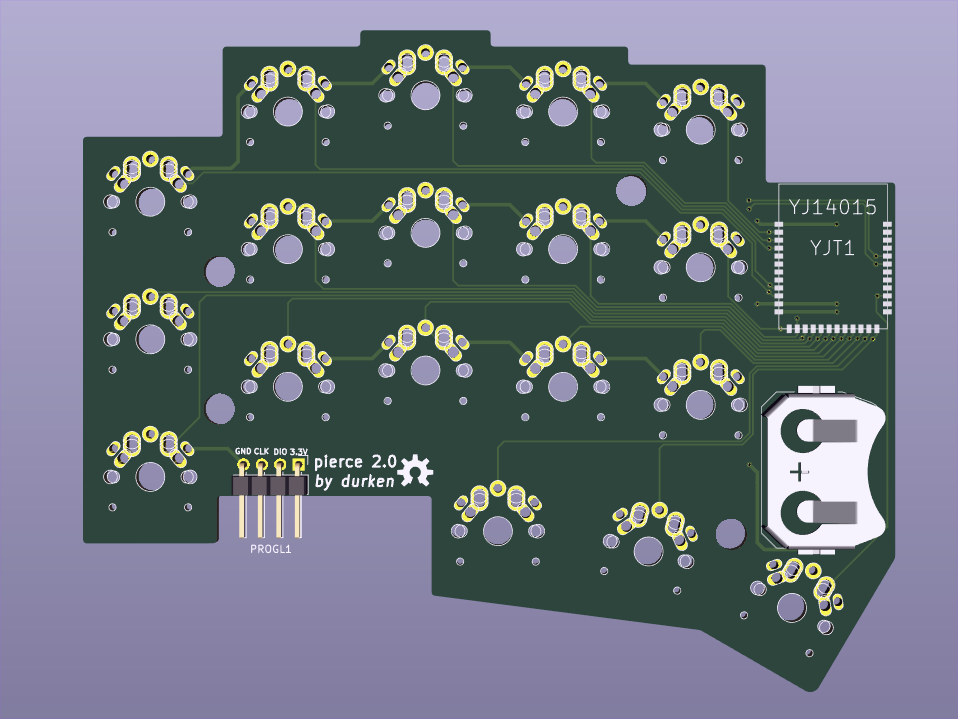
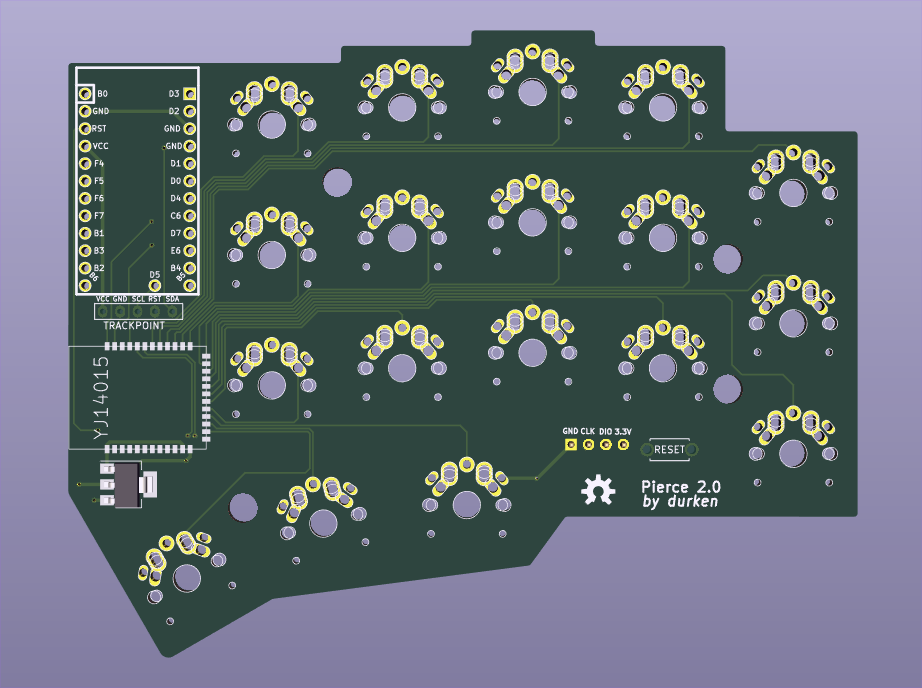
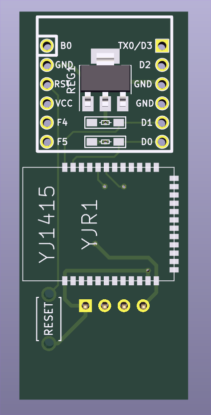

# Work in progress

# pierce 2.0

pierce 2.0 is a split modular wireless / semi-wireless 36 key column staggered keyboard. The design is inspired by [Corne](https://github.com/foostan/crkbd) 
with more pinky stagger as well as only using 1u keycaps.
It is possible to build a wireless version or a semi wireless version. If building the wireless version an additional reciever dongle is required. 
In the semi wireless version the wired half is also acting as a reciever for the wireless half. 
Both versions have full QMK support.  
Supported switches: MX, Choc V1, Alps

The semi wireless version has built in trackpoint support (a few extra components required).

There are 3 different PCBs: wireless (reversible), wired (right) and reciever.

# Bill of materials
## Wireless
| Qty | Item                                          | Comments                                            |
|----:|-----------------------------------------------|-----------------------------------------------------|
|   2 | Pierce 2.0 wireless PCB                       |                                                     |
|   1 | Pierce 2.0 reciever PCB                       |                                                     |
|   1 | Pro micro or equivalent                       |                                                     |
|   2 | Keystone 3034 Coin cell battery retainer      | SMD                                                 |
|   2 | 2032 3.3V Coin cell battery                   |                                                     |
|   3 | YJ-14015 / Core51822 (B)                      |                                                     |
|   3 | 1x4 pin Right-angle 2.54 mm header            | For programming RF modulules. Optional, temporary soldered wires works fine|
|   2 | 4.7 kΩ resistor                               | SMD 1206                                            |
|   1 | 1117 3.3 V regulator                          | SMD SOT-223                                         |
|   1 | THT momentary switch                          | 2 pin THT 6 mm                                      |
  
## Semi wireless
| Qty | Item                                          | Comments                                            |
|----:|-----------------------------------------------|-----------------------------------------------------|
|   1 | Pierce 2.0 wireless PCB                       |                                                     |
|   1 | Pierce 2.0 wired PCB                          |                                                     |
|   1 | Pro micro or equivalent                       |                                                     |
|   1 | Keystone 3034 Coin cell battery retainer      | SMD                                                 |
|   1 | 2032 3.3V Coin cell battery                   |                                                     |
|   2 | YJ-14015 / Core51822 (B)                      |                                                     |
|   2 | 1x4 pin Right-angle 2.54 mm header            | For programming RF modulules. Optional, temporary soldered wires works fine|
| 2/4 | 4.7 kΩ resistor                               | SMD 1206, 4 if using trackpoint, otherwise 2        |
|   1 | 1117 3.3 V regulator                          | SMD SOT-223                                         |
|   1 | THT momentary switch                          | 2 pin THT 6 mm                                      |
|   1 | 100 kΩ resistor                               | SMD 1206 Only for trackpoint                        |
|   1 | 2.2 uF capacitor                              | SMD 1206 Only for trackpoint                        |
|   1 | Trackpoint module                             | [R61](https://deskthority.net/wiki/TrackPoint_Hardware#ThinkPad_R61_TrackPoint) recommended, Only for.. well..|
  
# Build instructions
* Solder stuff
* Flash stuff
* Be happy

  
  

