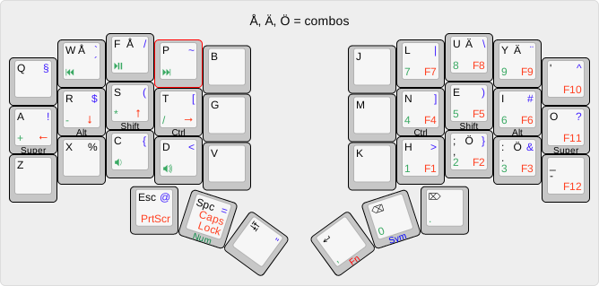

# pierce keyboard

* Based on crkbd
* Soldered Cherry MX / Kailh choc / alps
* Using one MCU and an IDC connection between halves
* Trackpoint connection including reset circuit
* Split 3x5+3 column stagger

Default keymap

