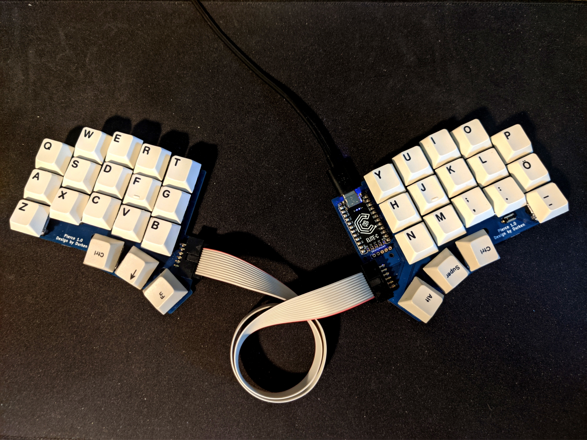

# pierce keyboard

* Based on crkbd
* Soldered Cherry MX / Kailh choc / alps
* Using one MCU and an IDC connection between halves
* Trackpoint connection including reset circuit
* Split 3x5+3 column stagger

[Firmware](https://github.com/durken1/pierce-wmod) for wireless modules. (No documentation at the moment, but I'm working on redesigning the PCBs to have wireless support in the develop branch)

# Bill of materials
| Qty | Item                                          | Notes                                               |
|----:|-----------------------------------------------|-----------------------------------------------------|
|   1 | Pierce left PCB                               |                                                     |
|   1 | Pierce right PCB                              |                                                     |
|  36 | Diodes                                        | 1N4148W or similar SOD-123                          |
|  36 | Switches                                      | MX, Choc V1 or alps                                 |
|   1 | Microcontroller                               | Elite-c recommended if using trackpoint             |
|   2 | Angled 12 pin IDC connector                   | [Example](https://www.conrad.com/p/tru-components-1589771-pin-connector-no-ejector-contact-spacing-254-mm-total-number-of-pins-12-no-of-rows-2-1-pcs-1589771)|
|   2 | 12 pin IDC pin connector                      | [Example](https://www.conrad.com/p/bkl-electronic-10120991-pin-connector-strain-relief-contact-spacing-254-mm-total-number-of-pins-12-no-of-rows-2-1-2103795)|
|   1 | 12 connector ribbon cable                     | [Example](https://www.conrad.com/p/lapp-49900055-ribbon-cable-contact-spacing-127-mm-14-x-009-mm-grey-sold-per-metre-609735)|
|   1 | 6.5 mm reset switch                           | [Example](https://www.conrad.com/p/tru-components-yst-1101-pushbutton-12-v-dc-005-a-1-x-offon-momentary-1-pcs-1569015)|

If using trackpoint:

| Qty | Item                                          | Notes                                               |
|----:|-----------------------------------------------|-----------------------------------------------------|
|   1 | Trackpoint module                             | [R61](https://deskthority.net/wiki/TrackPoint_Hardware) recommended|
|   1 | 100 kOhm resistor                             | SMD 1206                                                    |
|   2 | 4.7 kOhm resistor                             | SMD 1206                                                    |
|   1 | 2.2 uF capacitor                              | SMD 1206                                                    |

For 3D-printed case:
| Qty | Item                                          | Notes                                               |
|----:|-----------------------------------------------|-----------------------------------------------------|
|  10 | 6mm M2 spacer                                 |                                                     |
|  20 | 6mm M2 screw                                  | Countersunk recommended                             |

[Firmware](https://github.com/durken1/qmk_firmware/tree/pierce/keyboards/pierce)

